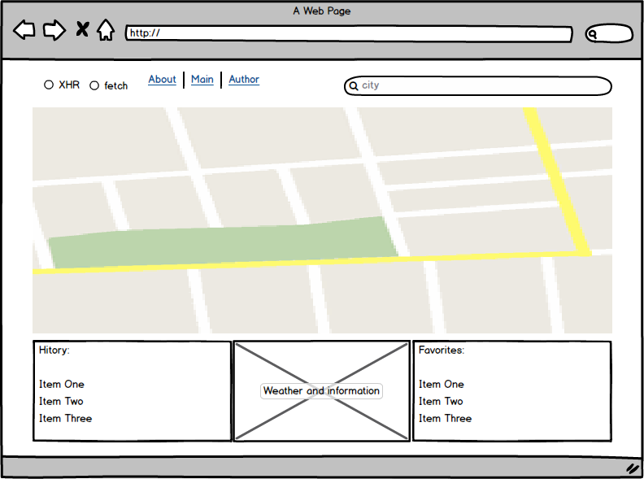

# Сайт "Прогноз погоды"

## Общая задача

Сайт состоит из трех блоков.

1. в шапке сайта находится форма с полем ввода и кнопкой "Искать" и переключатель механизма запроса (два радиобаттона `fetch`/`XHR`) и меню, ведущее на другие страницы
2. центральная часть содержит информационное описание для главной страницы. И прогноз погоды для страницы конкретного города. В случае ошибки при запросе она отображает сообщение об ошибке
3. в подвале сайта отображаются 5 последних городов, погоду в которых искал пользователь. При ошибке запрос не добавляется в списко

## Детали

* В любой момент времени взаимодействия с картой - ее состояние должно отображаться на URL-адрес, чтобы при обновлении страницы / отпавке ссылки другому человеку - страница открывалась на той же точке
* При вводе текста в поле ввода и нажатие кнопки "Ввод" ( или по клику на кнопке "Искать" ) пользователь попадает на страницу с прогнозом погоды в заданном городе. При этом страницу можно добавить в закладки или отправить сообщением - при открытии ссылки должен показаться тот же город.
* При изменении центра карты ( перетаскивание / зум ) должны отображаться данные по погоде для центра карты
* При поиске города он появляется верхним пунктов в списке последних запросов ( нижний блок ), остальные пункты опускаются на 1 вниз. Пункты с номером больше 5 исчезают.
* В любой точке на карте можно нажать 'Add to Favorites' - это добавить точку с описанием в список "Избранное". Из списка сущность можно удалить с помощью `x` возле записи. При клике на запись в списке "Избранное" происходит переход на сохраненные координаты
* Функция загрузки прогноза должна быть реализована в двух вариантах - с использованием fetch и с использованием XHR. Блок с options для выбора (два пункта из которых всегда выбран только один) какую из реализаций использовать для получения следующего прогноза. Этот же переключатель влияет на реализацию всех запросов на сторонние ресурсы (определение координат пользователя, конвертация города в координаты и тп )
* Для загрузки прогноза погоды использовать сайт https://darksky.net/
* Для получения координат по введенным данным использовать API Google Maps
* В шапку страницы добавить меню с двумя пунктами `Главная` / `О сайте`
  Каждый пункт меню должен открывать соответствующую страницу.
  "O сайте" - Отображает статическую информацию - ваше имя, фото, ссылки на соцсети и свободный текст
  "Главная" - при входе на страницу сайт определяет местоположение пользователя ( запросом на `https://api.userinfo.io/userinfos` или на аналогичный ресурс) и перенаправляет на страницу с соответсвующими координатами
* Должны поддерживаться ссылки с указанием города ( например `/city/Minsk` )
